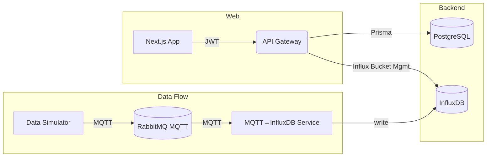

# Aperçu du projet

EcoWatch est une plateforme de monitoring environnemental composée de plusieurs applications orchestrées dans un monorepo pnpm.

## Architecture



## Prérequis

- Node.js 20+
- pnpm 9/10+
- Docker (pour l’infrastructure locale)

## Installation

```bash
pnpm install
pnpm prisma:generate
# optionnel
pnpm prisma:migrate
```

## Démarrage rapide

```bash
# 1) Stack infra (Postgres, Redis, RabbitMQ, InfluxDB, etc.)
docker compose up -d

# 2) Toutes les apps en mode dev
pnpm dev
```

Accès rapides:

- Web: `http://localhost:3000`
- API: `http://localhost:3001/api` (Swagger: `http://localhost:3001/docs`)
- Service MQTT→InfluxDB: `http://localhost:3002`


